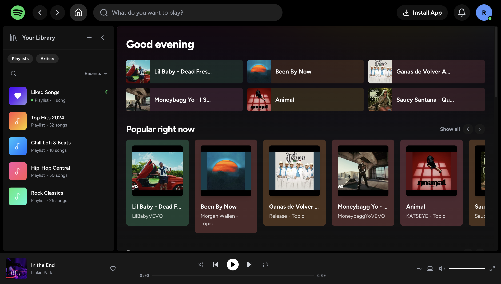

# 🎵 Spotify Web Application

A feature-rich, high-performance **Spotify Web Clone** built with **React**, **TypeScript**, **Tailwind CSS**, and **Vite**. Features intelligent music search, 5-tier official audio ranking, persistent queue playback, background next-track preloading, and a responsive dark-mode interface.

[](https://spotifyy-clonee.vercel.app/)

🔗 **Live Demo**: [https://spotifyy-clonee.vercel.app/](https://spotifyy-clonee.vercel.app/)

---

## ✨ Features

### 🔍 1. Smart Music Search Engine
- **Multi-Tier Search Fallback**: Executes query retries (`<query> official audio` -> `<query>` -> `<query> topic` -> `<query> official`) to ensure accurate results.
- **5-Level Official Ranking**:
  1. **Official Audio** (`Official Audio` / Topic Channels)
  2. **Topic Channels** (`- Topic`)
  3. **Official Artist Channels / VEVO**
  4. **Official Music Videos** (`Official Video`, `M/V`)
  5. **Lyric Videos**
- **Strict Content Filtering**: Excludes shorts, live recordings, karaoke, covers, remixes, and podcasts unless explicitly searched.
- **Instant Search Suggestions**: 250ms debounced search with `AbortController` cancellation for stale in-flight requests and query match text highlighting.
- **High-Reliability Quota Fallback**: Seamlessly falls back to iTunes Music Search API if YouTube API quota limits are hit.

### 🎧 2. Dual Playback Engine
- **YouTube & Direct Audio Support**: Plays YouTube stream audio via YouTube Iframe API and direct audio files via HTML5 Audio element.
- **Automatic Skip on Error**: Automatically detects unplayable, restricted, or deleted videos (error codes 2, 5, 100, 101, 150) and skips to the next track.
- **Persistent State**: Saves active track, progress, queue, volume, repeat mode (`Off` / `All` / `One`), and shuffle status in `localStorage` across page refreshes.
- **Background Preloading**: Pre-fetches metadata for upcoming queue tracks for instant playback transitions.

### 🎨 3. Spotify Design System
- **Dark Mode UI**: Crafted with Spotify’s signature dark aesthetic (`#121212`, `#181818`, `#1fdf64` green accents).
- **Rich Track Metadata**: Verified artist checkmark badges, high-res album thumbnails, formatted durations, view counts, and channel titles.
- **Interactive Controls**: Bottom Now Playing bar with hover accent progress slider, volume controls, liked songs library, and mobile nav bar.

---

## 🚀 Quick Start

### Prerequisites
- **Node.js** (v18+ recommended)
- **npm** or **yarn** or **bun**

### Installation

```bash
# 1. Install dependencies
npm install

# 2. Start the local development server
npm run dev
```

---

## 📦 Project Structure

```text
src/
├── components/
│   ├── cards/          # TrackCard, PlaylistCard, CategoryCard, RecentPlayCard
│   ├── layout/         # Header, Sidebar, NowPlayingBar, MobileNav, MainLayout
│   └── ui/             # HighlightText, Skeleton, Slider, DropdownMenu, etc.
├── contexts/
│   ├── playerContextCore.ts # Player state definitions & usePlayer hook
│   ├── PlayerContext.tsx    # Audio/YouTube playback provider engine
│   └── AuthContext.tsx      # User session management
├── pages/              # Home, Search, Library, LikedSongs, NowPlaying, Settings
├── services/           # youtubeApi.ts (Search, ranking, fallback & caching)
└── lib/                # Utility helpers & color generators
```

---

## 🌐 Deployment on Vercel

This repository includes a `vercel.json` configuration file with single-page application (SPA) rewrite rules to prevent 404 Not Found errors on sub-routes (`/search`, `/library`, etc.) when deployed to Vercel:

```json
{
  "rewrites": [
    {
      "source": "/(.*)",
      "destination": "/index.html"
    }
  ]
}
```

---

## 📜 License

This project is open-source under the MIT License.
